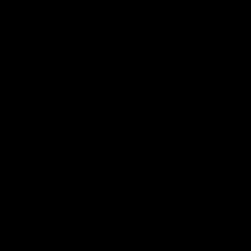

# SnakeAI

AI to simlulate and play the game snake in attempt achieve maximum score.

## Method
The Snake uses the "Q-learning" Reinforcement learning technique to best pick it's next move.
The Snake does not play perfectly, this is due to the limits of space storage in basic Q-learning. 
The ammount of storage required is given by `States x Actions`.

The snake has a limited number of sensors:

```
Food:
Above, Below, or Inline
Left, Right, or Inline

Danger:
Ahead, Left, or Right
```
A limit number of moves:
```
Turn Left, Turn Right, Go Forward
```
This provides a total of 288 possible states. The addition of extra states causes exponential growth.

## Running SnakeAI
Running the existing provided Q-Table.
```
$ python SnakeAI.py
```
Overriding the existing Q-Table with new values and no gameplay display.
```
$ python SnakeAI.py --learn 100000 --no-display
```
## Demo
